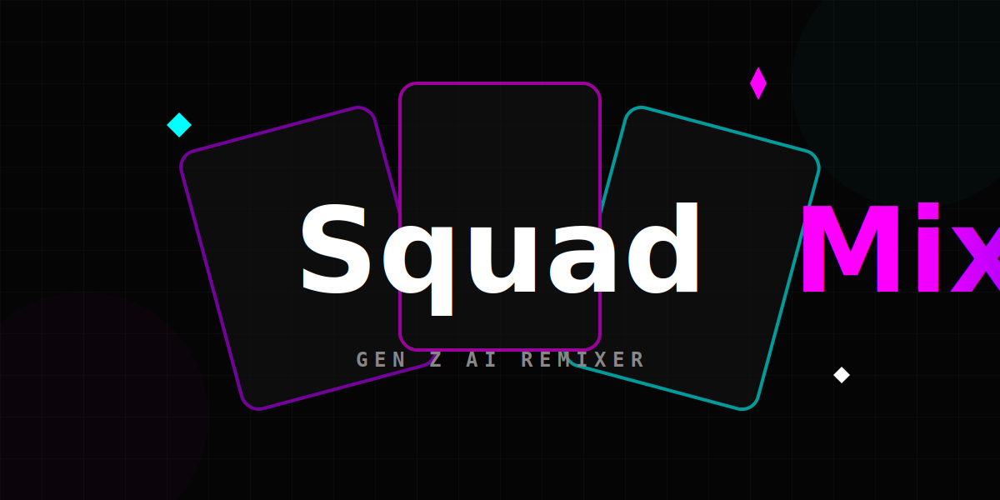

# SquadMix Gen Z 📸

**SquadMix** is a React-based web application that uses Google's **Gemini 2.5 Flash** multimodal AI to remix individual photos of friends into cohesive, stylized group shots. Designed with a "Gen Z" aesthetic, it features a neon-dark mode UI, rapid generation times, and varied "vibes" ranging from 90s Retro to Cyberpunk.

## 🚀 Features

*   **Multi-Image Upload**: Select 1 to 5 individual photos.
*   **Vibe Check**: Choose from 10 distinct styles:
    *   🛋️ Chilling
    *   🪩 Party
    *   🎉 Hyped
    *   🦄 Toon
    *   🤖 Cyberpunk
    *   🏖️ Sunny
    *   📼 90s Retro
    *   🎡 Festival
    *   💼 Founders
    *   ⚔️ RPG Fantasy
*   **Flexible Formatting**: Support for Square (1:1), Portrait (3:4), and Wide (16:9) aspect ratios.
*   **Instant "Cooking"**: Powered by the high-speed Gemini 2.5 Flash Image model.
*   **Privacy Focused**: Images are processed directly via the API; no backend storage required.

## 🛠️ Tech Stack

*   **Frontend**: React 19
*   **Styling**: Tailwind CSS (Dark Mode, Custom Animations)
*   **AI Model**: Google Gemini 2.5 Flash Image (`gemini-2.5-flash-image`)
*   **SDK**: `@google/genai`
*   **Build Tooling**: ES Modules (Browser-native imports)

## 📦 Installation & Setup

1.  **Clone the repository**:
    ```bash
    git clone https://github.com/your-username/squad-mix.git
    ```

2.  **API Key Configuration**:
    *   Get your API key from [Google AI Studio](https://aistudio.google.com/).
    *   Ensure the key is available in your environment variables as `process.env.API_KEY`.

3.  **Run the Application**:
    *   Open `index.html` in a modern browser or serve via a local server (e.g., `npx serve`, Live Server).

## 💡 Usage

1.  **Drop the Pics**: Click the upload zone to select photos of your friends.
2.  **Pick the Vibe**: Select a style tile (e.g., "Cyber").
3.  **Shape It**: Choose your preferred aspect ratio.
4.  **Cook It Up**: Hit the button and wait for the AI to generate your squad photo.
5.  **Download**: Save the masterpiece to your device.

## 📄 License

MIT License.