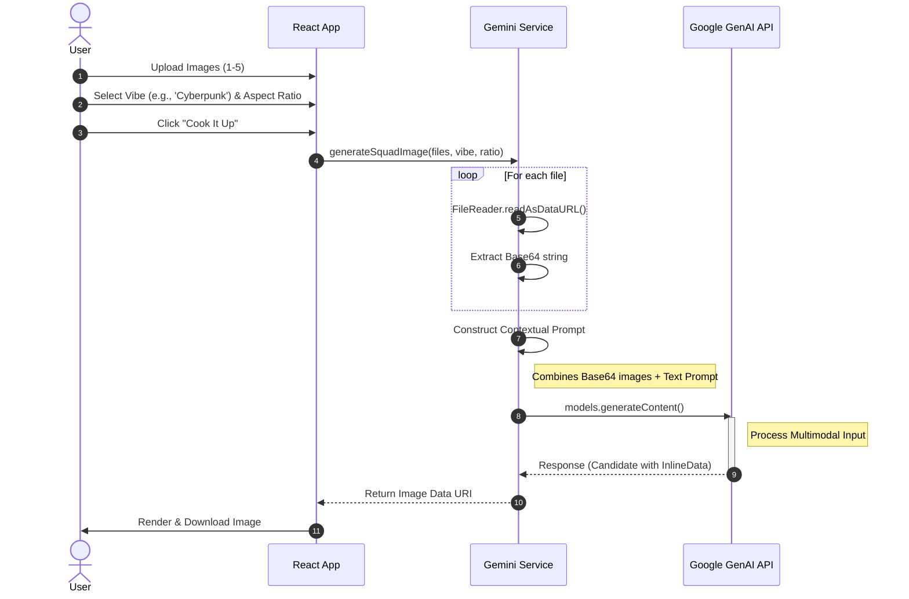

# Building SquadMix: A Technical Deep Dive into Gen Z AI Photo Composition

In the age of remote work and digital friendships, getting a photo of your whole "squad" together is harder than ever. And even when you are together, getting everyone to look at the camera at the same time is a miracle.

I decided to solve this using the power of Multimodal AI. Enter **SquadMix**, a web application that takes individual photos of people and merges them into stylized, cohesive group portraits using **Google Gemini 2.5 Flash**.

In this post, we'll go beyond the basics and look at the **System Architecture**, **Data Flow**, and **Component Design** that powers the app.

## The Concept 💡

The goal was simple: **Input** (separate photos of friends) + **Vibe** (Style/Context) = **Output** (One epic group photo).

I wanted the UI to feel modern and appealing to a younger demographic—think dark modes, neon accents, and emojis. But more importantly, I wanted the technology underneath to be blazing fast.

## System Architecture 🏗️

SquadMix follows a **Client-Server** architecture, but strictly as a "Thick Client" interacting directly with a 3rd Party API (Google Gemini). We removed the need for an intermediate backend server to reduce latency and complexity.

```mermaid
graph TB
    subgraph Client_Device [Client Device / Browser]
        direction TB
        
        subgraph UI_Layer [UI Layer (React 19)]
            AppComponent[App.tsx]
            UploadZone[UploadZone.tsx]
        end
        
        subgraph Logic_Layer [Logic Layer]
            State[State Management]
            Service[Gemini Service]
            PromptEng[Prompt Engineering Logic]
        end
    end
    
    subgraph Cloud_Infrastructure [Google Cloud Platform]
        GeminiModel[Gemini 2.5 Flash Image Model]
        SafetyFilters[Safety & Privacy Filters]
    end
    
    AppComponent --> State
    AppComponent --> Service
    
    Service --> PromptEng
    
    Service -- "HTTPS / JSON (Multimodal Payload)" --> SafetyFilters
    SafetyFilters --> GeminiModel
    GeminiModel -- "Generated Image Blob" --> Service
```

### Key Components
1.  **Client (React App)**: Handles UI/UX, file processing (Base64 conversion), and state management.
2.  **AI Service Provider (Google Cloud)**: Exposes the Gemini API to process multimodal inputs.

## The Data Flow 🔄

Understanding how data moves from a user's local file system to the cloud and back is critical. Here is the exact sequence of events when a user clicks "Cook It Up":



## Component Design (LLD) 🧩

We kept the codebase modular to ensure maintainability.

### 1. The Orchestrator (`App.tsx`)
This container manages the global state:
*   `files`: Array of `File` objects uploaded by the user.
*   `selectedVibe`: Enum `VibeType` (e.g., `VibeType.RETRO_90S`).
*   `generatedImage`: The resulting Base64 string URL.

### 2. The Service Layer (`geminiService.ts`)
This is a pure TypeScript module handling API communication. It contains two core functions:

**A. `fileToPart`**:
Converts raw browser `File` objects into the format Gemini expects.
```typescript
const fileToPart = (file: File) => {
  return new Promise((resolve) => {
    const reader = new FileReader();
    reader.onloadend = () => {
      // Extract base64 data, removing the data URL prefix
      const base64Data = reader.result.split(',')[1];
      resolve({ inlineData: { data: base64Data, mimeType: file.type } });
    };
    reader.readAsDataURL(file);
  });
};
```

**B. `generateSquadImage`**:
This function handles the "Prompt Engineering". Depending on the `VibeType` selected, we dynamically inject descriptions into the prompt.
*   *If Vibe is 'Startup':* "They should look like a successful tech startup founding team..."
*   *If Vibe is 'Festival':* "They should be at a golden-hour music festival like Coachella..."

## Why Gemini 2.5 Flash? ⚡

For this project, I chose Google's **Gemini 2.5 Flash Image** model. Here is why:

1.  **Speed**: Flash is optimized for low latency. Waiting 30 seconds for an image generation kills the "fun" factor. Flash delivers results rapidly.
2.  **Multimodal Native**: It doesn't just look at text. It natively understands image inputs. I can pass it 5 distinct images and a text prompt, and it understands the assignment.

## Challenges & Learnings

*   **Consistency**: Preserving facial identity in GenAI is tough. By tweaking the prompt to explicitly say *"Maintain the facial features and identifying characteristics"*, the model does a much better job of keeping your friends recognizable.
*   **File Handling**: Handling multiple file uploads and managing browser memory requires care. We limit uploads to 5 images to ensure the payload stays within reasonable limits for the API.

## Conclusion

SquadMix demonstrates how accessible powerful AI tools have become. With just a few hundred lines of code, we built a "Thick Client" application that performs complex image composition tasks that previously required manual editing.

Check out the repo to try it yourself! 🚀
