# Building SquadMix: A Technical Deep Dive into Gen Z AI Photo Composition

In the age of remote work and digital friendships, getting a photo of your whole "squad" together is harder than ever. And even when you are together, getting everyone to look at the camera at the same time is a miracle.

I decided to solve this using the power of Multimodal AI. Enter **SquadMix**, a web application that takes individual photos of people and merges them into stylized, cohesive group portraits using **Google Gemini 2.5 Flash**.

In this post, we'll go beyond the basics and look at the **System Architecture**, **Prompt Engineering**, and **Component Design** that powers the app.

## The Concept 💡

The goal was simple: **Input** (separate photos of friends) + **Vibe** (Style/Context) = **Output** (One epic group photo).

I wanted the UI to feel modern and appealing to a younger demographic—think dark modes, neon accents, and emojis. But more importantly, I wanted the technology underneath to be blazing fast.

## System Architecture 🏗️

SquadMix follows a **Client-Serverless** architecture. We act as a "Thick Client," interacting directly with the 3rd Party API (Google Gemini). We removed the need for an intermediate backend server to reduce latency and complexity.

### Why Serverless?
1.  **Latency**: By removing the middle hop (Client -> My Server -> Google -> My Server -> Client), we shave off valuable milliseconds.
2.  **Privacy**: User images process in-memory and go straight to the API provider. I don't store them.
3.  **Cost**: No EC2 instances or Lambda cold starts to worry about.

```mermaid
graph TB
    %% Styles (No black used)
    classDef ui fill:#e8e3ff,stroke:#6a5acd,stroke-width:2px,color:#1a1a1a
    classDef logic fill:#e0f7fa,stroke:#00acc1,stroke-width:2px,color:#1a1a1a
    classDef cloud fill:#ffe4f2,stroke:#ff69b4,stroke-width:2px,color:#1a1a1a
    classDef container fill:#f7f7f7,stroke:#b0b0b0,stroke-width:2px,stroke-dasharray: 5 5,color:#333

    subgraph Client_Device["💻 Client Device / Browser"]
        direction TB
        
        subgraph UI_Layer["🎨 Presentation Layer"]
            CoreUI["Main Application View"]:::ui
            InputMod["Input Module"]:::ui
        end
        
        subgraph Logic_Layer["🧠 Business Logic Layer"]
            StateManager["State Manager"]:::logic
            APIService["Integration Service"]:::logic
            PromptEng["Prompt Engine"]:::logic
        end
    end
    
    subgraph Cloud_Infrastructure["☁️ Google Cloud Platform"]
        GeminiModel["♊ Gemini 2.5 Flash"]:::cloud
        SafetyFilters["🛡️ Safety Filters"]:::cloud
    end
    
    %% Applying Container Styles
    class Client_Device,Cloud_Infrastructure container

    CoreUI --> StateManager
    CoreUI --> APIService
    
    APIService --> PromptEng
    
    APIService -- "HTTPS / JSON (Multimodal Payload)" --> SafetyFilters
    SafetyFilters --> GeminiModel
    GeminiModel -- "Generated Image Blob" --> APIService
```



## The Data Flow 🔄

Understanding how data moves from a user's local file system to the cloud and back is critical. Here is the exact sequence of events when a user clicks "Cook It Up":

1.  **Ingestion**: React accepts files via `<input type="file" />`.
2.  **Conversion**: We use the `FileReader` API to convert binary BLOBS into Base64 strings.
3.  **Orchestration**: These strings are packed into a standard JSON payload alongside the text prompt.
4.  **Generation**: Gemini receives the payload, performs the diffusion/generation, and returns a Base64 PNG.


## Deep Dive: Prompt Engineering 🧠

The secret sauce isn't just the code; it's the **Prompt**.

We dynamically construct the prompt based on user selection. We found that generic prompts led to generic results. To fix this, we used a strategy of **Context Injection** + **Constraint Enforcement**.

### The Formula
`[Base Instruction] + [Vibe Specific Context] + [Identity Constraints]`

### Example Construction
If the user selects the **"Startup"** vibe, our code constructs:

1.  **Base**: "Generate a high-quality, cohesive group image featuring the people from the provided reference images."
2.  **Vibe**: "They should look like a successful tech startup founding team posing for a magazine cover. Smart casual, arms crossed, confident smiles, modern office background."
3.  **Constraint**: "Maintain the facial features and identifying characteristics of each person from the source images as much as possible."

This specific combination forces the model to blend the subjects creatively while respecting their identities.

## Component Design (LLD) 🧩

We kept the codebase modular to ensure maintainability.

### 1. The Service Layer (`geminiService.ts`)
This is a pure TypeScript module handling API communication. It contains a helper `fileToPart`:

```typescript
const fileToPart = (file: File) => {
  return new Promise((resolve) => {
    const reader = new FileReader();
    reader.onloadend = () => {
      // Extract base64 data, removing the data URL prefix
      const base64Data = reader.result.split(',')[1];
      resolve({ inlineData: { data: base64Data, mimeType: file.type } });
    };
    reader.readAsDataURL(file);
  });
};
```

This helper is crucial because the Gemini SDK expects raw Base64, but standard Browser APIs give you Data URIs with MIME prefixes.

## Why Gemini 2.5 Flash? ⚡

For this project, I chose Google's **Gemini 2.5 Flash Image** model. Here is why:

1.  **Speed**: Flash is optimized for low latency. Waiting 30 seconds for an image generation kills the "fun" factor. Flash delivers results in ~5-10 seconds.
2.  **Multimodal Native**: It doesn't just look at text. It natively understands image inputs. I can pass it 5 distinct images and a text prompt, and it understands the assignment.

## Challenges & Future Improvements 🚀

*   **Identity Consistency**: While Gemini is good, sometimes it hallucinates new people or alters faces too much. Future versions could use more advanced prompt tuning or face-swapping post-processing (though that adds complexity).
*   **Bandwidth**: Uploading 5 full-res photos is heavy. We plan to implement **Client-Side Compression** using a canvas element to resize images to 1024px max-width before uploading, saving user data and speeding up requests.

## Conclusion

SquadMix demonstrates how accessible powerful AI tools have become. With just a few hundred lines of code, we built a "Thick Client" application that performs complex image composition tasks that previously required manual editing.

Check out the repo to try it yourself! 🚀