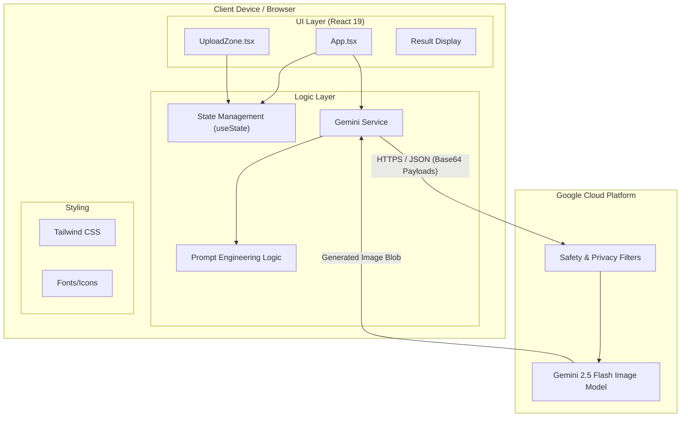

# Architecture Diagram

## Diagram Explanation
This diagram provides a structural view of the **SquadMix** application.

1.  **Client Device Scope**: The left box encapsulates everything running on the user's machine.
    *   **UI Layer**: The visual components the user interacts with (`App`, `UploadZone`).
    *   **Logic Layer**: The JavaScript code running in the browser memory. Crucially, `PromptEng` (Prompt Engineering) happens here—we construct the text prompt on the client before sending it.
    *   **Styling**: Tailwind CSS handles the visual presentation.

2.  **Cloud Infrastructure Scope**: The right box represents Google's managed services.
    *   **Safety Filters**: Before the model processes data, Google's Trust & Safety layer scans the input images and text prompt for policy violations.
    *   **Gemini Model**: The core inference engine that generates the image.

3.  **Connection**: The arrow labeled `HTTPS / JSON` represents the API call. It carries a heavy payload (multiple Base64 images), which is why `Gemini 2.5 Flash` is preferred for its high throughput.

