# Architecture Diagram

## Diagram Explanation
This diagram provides a structural view of the **SquadMix** application, styled with the app's Neon/Dark aesthetic.

1.  **Client Device Scope**: The left box encapsulates everything running on the user's machine.
    *   **Presentation Layer**: The visual interface components responsible for user interaction and rendering.
    *   **Business Logic**: The JavaScript runtime handling state, service communication, and prompt engineering.
    *   **Theme Engine**: The styling system powered by Tailwind CSS.

2.  **Cloud Infrastructure Scope**: The right box represents Google's managed services.
    *   **Safety Filters**: The Trust & Safety layer that scans inputs before processing.
    *   **Gemini Model**: The multimodal inference engine (`gemini-2.5-flash-image`) that synthesizes the final image.

3.  **Data Flow**: The arrows represent the movement of data, specifically the HTTPS transport of JSON payloads containing Base64 encoded images.

```mermaid
graph TB
    %% Define Custom Styles
    classDef base fill:#121212,stroke:#333,stroke-width:1px,color:#aaa
    classDef ui fill:#1a1a1a,stroke:#bd00ff,stroke-width:2px,color:#fff,shadow:0 0 10px #bd00ff
    classDef logic fill:#1a1a1a,stroke:#00ffff,stroke-width:2px,color:#fff
    classDef google fill:#1a1a1a,stroke:#ff00ff,stroke-width:2px,color:#fff
    classDef container fill:#050505,stroke:#333,stroke-width:2px,stroke-dasharray: 5 5,color:#eee

    subgraph Client_Device ["💻 Client Device / Browser"]
        direction TB
        
        subgraph UI_Layer ["🎨 Presentation Layer"]
            direction TB
            CoreUI["Main Application View"]:::ui
            InputMod["Input Module"]:::ui
            OutputMod["Result Renderer"]:::ui
        end
        
        subgraph Logic_Layer ["🧠 Business Logic Layer"]
            direction TB
            StateManager["State Manager"]:::logic
            APIService["Integration Service"]:::logic
            PromptEng["Prompt Engine"]:::logic
        end
        
        subgraph Styling ["💅 Theme Engine"]
            direction TB
            CSS["Utility CSS Classes"]:::base
            Assets["Static Assets"]:::base
        end
    end
    
    subgraph Cloud_Infrastructure ["☁️ Google Cloud Platform"]
        direction TB
        GeminiModel["♊ Gemini 2.5 Flash"]:::google
        SafetyFilters["🛡️ Safety Filters"]:::google
    end

    %% Apply Container Styles
    class Client_Device,Cloud_Infrastructure container

    %% Connections
    CoreUI --> StateManager
    CoreUI --> APIService
    InputMod --> StateManager
    
    APIService --> PromptEng
    
    APIService -- "HTTPS / JSON<br/>(Base64 Payload)" --> SafetyFilters
    SafetyFilters --> GeminiModel
    GeminiModel -- "Response<br/>(Image Blob)" --> APIService
    
    %% Link Styling
    linkStyle default stroke:#666,stroke-width:1px
```

