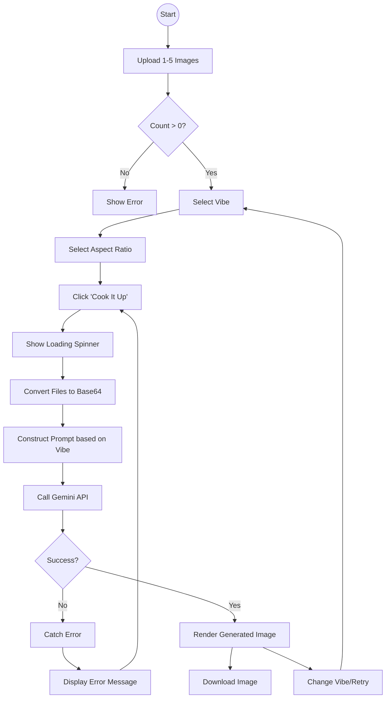

# User Flow Diagram

```mermaid
graph TD
    Start((Start)) --> Upload[Upload 1-5 Images]
    Upload --> Check{Count > 0?}
    Check -- No --> Error[Show Error]
    Check -- Yes --> Vibe[Select Vibe]
    
    Vibe --> Ratio[Select Aspect Ratio]
    Ratio --> Cook[Click 'Cook It Up']
    
    Cook --> Loading[Show Loading Spinner]
    Loading --> Process[Convert Files to Base64]
    Process --> Prompt[Construct Prompt based on Vibe]
    Prompt --> API[Call Gemini API]
    
    API --> Result{Success?}
    
    Result -- No --> Catch[Catch Error]
    Catch --> DisplayErr[Display Error Message]
    DisplayErr --> Cook
    
    Result -- Yes --> Render[Render Generated Image]
    Render --> Download[Download Image]
    Render --> Retry[Change Vibe/Retry]
    Retry --> Vibe
```
