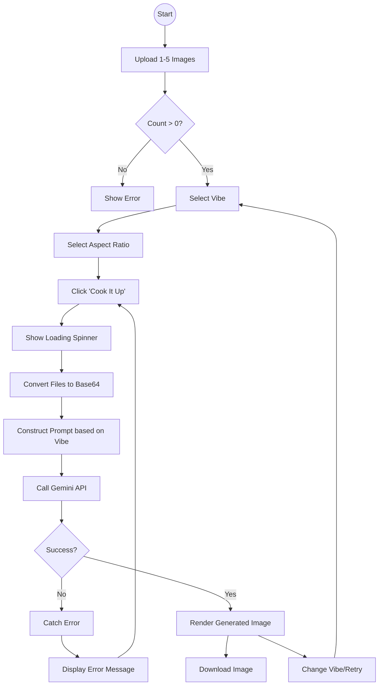

# User Flow Diagram

## Diagram Explanation
This flowchart maps the user's interactive journey through the application.

*   **Start**: The user lands on the index page.
*   **Validation (Check)**: The system prevents the user from proceeding if no images are selected. This is a client-side validation step.
*   **Configuration**: The user has two axes of configuration: **Vibe** (Style) and **Ratio** (Dimensions).
*   **Processing (Loading)**: The "Cook It Up" action triggers the API call. This is the synchronous wait period where the UI shows a spinner.
*   **Result Handling**: 
    *   **Success Path**: The image is rendered, and the user can download it or try again.
    *   **Failure Path**: If the API fails (e.g., rate limit, safety block), the error is caught, displayed, and the user is returned to the configuration state to try again.

