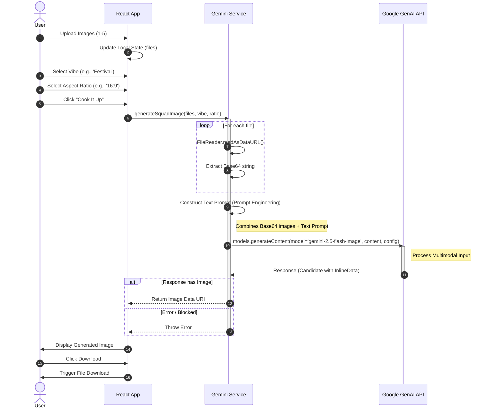

# Sequence Diagram

## Diagram Explanation
This sequence diagram details the technical handshake between the frontend and the API.

1.  **User Interaction**: The user drives the flow (Actor `User`).
2.  **State Updates**: The `UI` (React App) updates its local state immediately upon user actions (selecting files/vibes).
3.  **Service Activation**: When "Cook It Up" is clicked, the `Service` layer takes over.
4.  **The Loop**: The `loop` block highlights a critical performance step: iterating through every uploaded file and converting it to Base64 using `FileReader`. This happens asynchronously in parallel (`Promise.all`).
5.  **API Call**: The `Google` participant represents the external API. Note that the `Service` sends the request and waits (activates) until a response is received.
6.  **Alt Block**: Handles the two possible outcomes from Google:
    *   **Success**: An image is returned.
    *   **Failure**: An error is thrown (e.g., 500 Internal Server Error).
7.  **Final Action**: The UI updates to show the result or error to the user.

