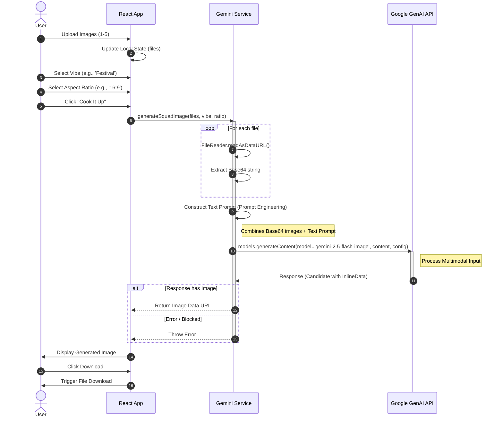

# Sequence Diagram

```mermaid
sequenceDiagram
    autonumber
    actor User
    participant UI as React App
    participant Service as Gemini Service
    participant Google as Google GenAI API

    User->>UI: Upload Images (1-5)
    UI->>UI: Update Local State (files)
    User->>UI: Select Vibe (e.g., 'Festival')
    User->>UI: Select Aspect Ratio (e.g., '16:9')
    User->>UI: Click "Cook It Up"
    
    UI->>Service: generateSquadImage(files, vibe, ratio)
    activate Service
    
    loop For each file
        Service->>Service: FileReader.readAsDataURL()
        Service->>Service: Extract Base64 string
    end
    
    Service->>Service: Construct Text Prompt (Prompt Engineering)
    
    note right of Service: Combines Base64 images + Text Prompt
    
    Service->>Google: models.generateContent(model='gemini-2.5-flash-image', content, config)
    activate Google
    
    note right of Google: Process Multimodal Input
    
    Google-->>Service: Response (Candidate with InlineData)
    deactivate Google
    
    alt Response has Image
        Service-->>UI: Return Image Data URI
    else Error / Blocked
        Service-->>UI: Throw Error
    end
    deactivate Service
    
    UI->>User: Display Generated Image
    User->>UI: Click Download
    UI->>User: Trigger File Download
```
